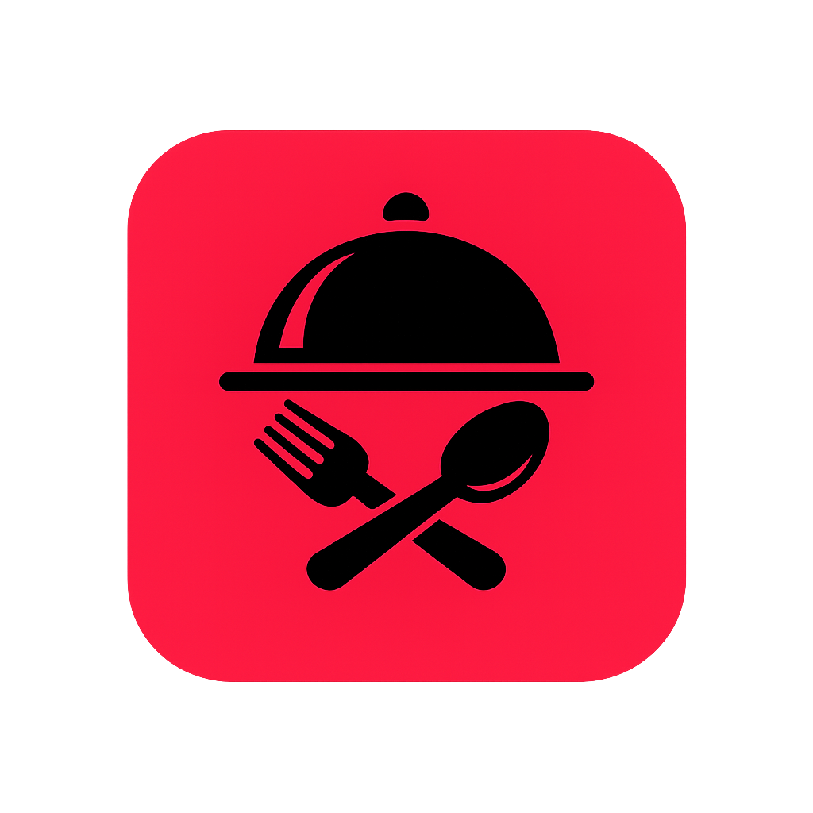

<p align="center">
  
</p>

<h1 align="center">NutriZham 🥗</h1>

<p align="center">
  <b>Trilingual meal planner & recipe discovery app</b><br />
  English &bull; Kurdish &bull; Arabic
</p>

<p align="center">
  <a href="#-features"></a>
  <a href="#-tech-stack"></a>
  <a href="LICENSE"></a>
  <a href="https://dart.dev"></a>
  <br />
  <a href="#"></a>
  <a href="#"></a>
  <a href="#"></a>
</p>

---

## 📋 Table of Contents

- [Features](#-features)
- [Tech Stack](#-tech-stack)
- [Architecture](#-architecture)
- [Getting Started](#-getting-started)
- [Firebase Setup](#-firebase-setup)
- [Contributing](#-contributing)
- [License](#-license)

---

## ✨ Features

<table>
  <tr>
    <td width="33%">
      <h3>🔐 Authentication</h3>
      <ul>
        <li>Email/password register & login</li>
        <li>Google Sign‑In</li>
        <li>Password reset & change</li>
        <li>Profile editing</li>
      </ul>
    </td>
    <td width="33%">
      <h3>🍽 Recipe Discovery</h3>
      <ul>
        <li>Infinite scroll pagination</li>
        <li>6 category filters</li>
        <li>Search by name or ingredient</li>
        <li>A–Z category browse</li>
      </ul>
    </td>
    <td width="33%">
      <h3>📅 Meal Planner</h3>
      <ul>
        <li>Weekly calendar view</li>
        <li>4 meal slots per day</li>
        <li>Drag to reorder</li>
        <li>Auto grocery list</li>
      </ul>
    </td>
  </tr>
  <tr>
    <td width="33%">
      <h3>📊 Nutrition</h3>
      <ul>
        <li>Per-recipe macros</li>
        <li>Daily goals (calories, protein, carbs, fats)</li>
        <li>Visual progress bars</li>
        <li>Weekly summary stats</li>
      </ul>
    </td>
    <td width="33%">
      <h3>🌐 Localization</h3>
      <ul>
        <li>English 🇬🇧</li>
        <li>Kurdish ☀️</li>
        <li>Arabic 🇸🇦</li>
        <li>Full RTL support</li>
      </ul>
    </td>
    <td width="33%">
      <h3>🎨 UI / UX</h3>
      <ul>
        <li>Material Design 3</li>
        <li>OLED dark mode</li>
        <li>Custom Rudaw font</li>
        <li>Shimmer loading & offline banner</li>
      </ul>
    </td>
  </tr>
</table>

---

## 🛠 Tech Stack

<div align="center">

| Category             | Technology                                    |
| -------------------- | --------------------------------------------- |
| **Framework**        | Flutter 3.x                                   |
| **Language**         | Dart ≥3.0                                     |
| **State Management** | flutter_bloc (Cubit)                          |
| **Routing**          | GoRouter                                      |
| **Backend**          | Firebase Auth + Firestore                     |
| **Auth Providers**   | Email/password, Google Sign-In                |
| **Local Cache**      | SharedPreferences + flutter_secure_storage    |
| **Localization**     | Flutter i18n (ARB files)                      |
| **Assets**           | flutter_launcher_icons, flutter_native_splash |
| **Font**             | Rudaw (custom Kurdish-compatible)             |

</div>

---

## 🏗 Architecture

```
lib/
├── core/              # Theme, constants, router, cache, utils
├── data/              # Datasources, models, repositories
├── domain/            # Entities, repository interfaces, use cases
├── l10n/              # Auto-generated localizations
└── presentation/      # Blocs (6 cubits), pages (12+ screens), widgets (50+)
```

**6 Cubits**: Auth, Favorites, MealPlanner, Recipe, Settings, Connectivity  
**50+ Reusable Widgets** across auth, common, planner, profile, recipe, settings

---

## 🚀 Getting Started

### Prerequisites

```bash
# Flutter SDK ≥3.0
flutter --version

# Firebase project with Auth & Firestore enabled
```

### Firebase Config

Place these files in your project (not committed):

```
android/app/google-services.json
ios/Runner/GoogleService-Info.plist
```

### Run

```bash
flutter pub get
flutter run
```

### Regenerate Assets

```bash
dart run flutter_native_splash:create    # Splash screen
dart run flutter_launcher_icons          # App icons
```

---

## 🔐 Firestore Security Rules

```js
rules_version = '2';
service cloud.firestore {
  match /databases/{database}/documents {
    match /users/{userId} {
      allow read, write: if request.auth != null
                       && request.auth.uid == userId;
    }
    match /recipes/{recipeId} {
      allow read: if request.auth != null;
      allow write: if false; // Admin-only writes
    }
  }
}
```

---

## 🤝 Contributing

Contributions are what make the open-source community such a great place. Any contributions you make are **greatly appreciated**.

1. Fork the project
2. Create your feature branch (`git checkout -b feature/amazing-feature`)
3. Commit your changes (`git commit -m 'Add amazing feature'`)
4. Push to the branch (`git push origin feature/amazing-feature`)
5. Open a pull request

### Code Style

- Run `dart format .` before committing
- Ensure `dart analyze lib/` passes with zero issues
- All files should stay under 200 lines
- Use the existing BLoC/Cubit pattern for new features

---

## 📦 Version

**v1.1.2** — 2026

---

## 📄 License

Distributed under the **MIT License**. See [`LICENSE`](LICENSE) for more information.

---

<p align="center">
  Built with Flutter & Firebase in Kurdistan 💖<br />
  <sub>Made for healthy living 🌱</sub>
</p>
